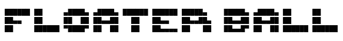

A physics-based collection game where you control a white ball that floats around a grid. Collect as many squares as possible within the time 
limit. Use the walls and other objects to your advantage and get the highest score possible. P.S. don't eat the red squares!

### Controls

| Key | Action |
|-----|--------|
| Arrow Keys | Move the ball |
| Shift | Brake / stop all movement |
| Spacebar | Continue to next level |
| P | Pause / resume the game |
| Esc | Exit to main menu |

### Scoring

| Item | Points | Details |
|------|--------|---------|
| Gray Square | 1 point | Standard food, spawns after each piece collected |
| Green Square | 5 points | 1–3 spawn randomly per level (Level 2+) |
| Purple Square | 10 points | Bonus food that appears after 5 seconds (Level 2+) |
| Orange Square | Power-up | Doubles ball size temporarily (no points) |
| Red Square | **Game Over!** | Forbidden fruit — appears on even-numbered levels (Level 2+) |
| Gold Triangle (Sticky Mines) | **Stuck for 5s!** | Freezes your ball for 5 seconds (Level 5+) |

### Obstacles

Black obstacles start appearing at Level 2, starting at 3 and increasing by 1 each level. Use them strategically!

**Sticky Mines** (gold triangles) appear on even-numbered levels after Level 5. Rolling over one freezes your ball for 5 seconds while the timer keeps counting.

## Progression

- **50 levels** total
- Starting time: **20 seconds** per level
- Every 3 levels, the time limit decreases by 1 second (minimum 5 seconds)
- Obstacles increase each level (starting at Level 2: 3 obstacles, +1 per level)


## Building the Desktop App

Install dependencies first:

```bash
npm install
```

Then use the `build.sh` script to compile for your target platform:

```bash
./build.sh          # Build for all platforms (default)
./build.sh mac      # macOS DMG
./build.sh linux    # Linux (AppImage, deb, rpm, snap)
./build.sh win      # Windows (NSIS installer + portable exe)
```

Output is placed in the `./dist/` folder.

## License

MIT License

Copyright (c) 2025 Drew D. Lenhart, SnowyWorks

Permission is hereby granted, free of charge, to any person obtaining a copy
of this software and associated documentation files (the "Software"), to deal
in the Software without restriction, including without limitation the rights
to use, copy, modify, merge, publish, distribute, sublicense, and/or sell
copies of the Software, and to permit persons to whom the Software is
furnished to do so, subject to the following conditions:

The above copyright notice and this permission notice shall be included in all
copies or substantial portions of the Software.

THE SOFTWARE IS PROVIDED "AS IS", WITHOUT WARRANTY OF ANY KIND, EXPRESS OR
IMPLIED, INCLUDING BUT NOT LIMITED TO THE WARRANTIES OF MERCHANTABILITY,
FITNESS FOR A PARTICULAR PURPOSE AND NONINFRINGEMENT. IN NO EVENT SHALL THE
AUTHORS OR COPYRIGHT HOLDERS BE LIABLE FOR ANY CLAIM, DAMAGES OR OTHER
LIABILITY, WHETHER IN AN ACTION OF CONTRACT, TORT OR OTHERWISE, ARISING FROM,
OUT OF OR IN CONNECTION WITH THE SOFTWARE OR THE USE OR OTHER DEALINGS IN THE
SOFTWARE.
